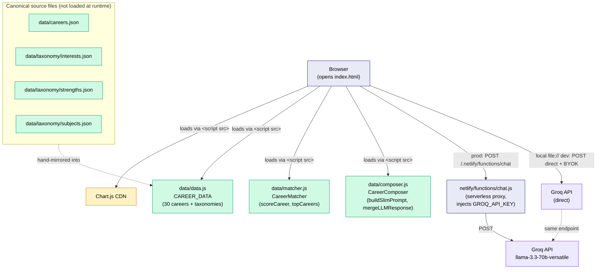
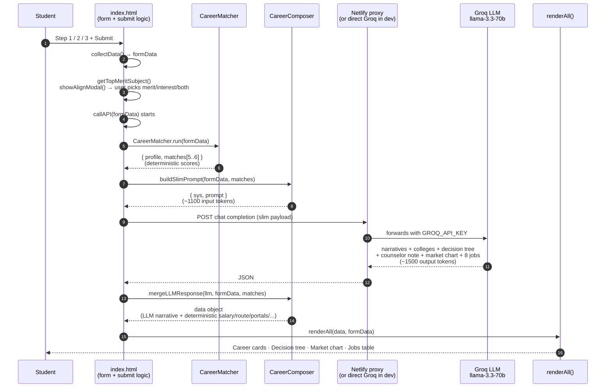
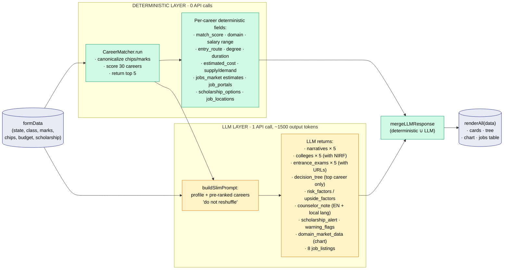

# CareerDisha — Architecture

Single-file HTML app for Indian student career guidance. Deterministic match engine picks careers; LLM writes narrative + decision tree + counselor note. The split is the cost lever — the LLM no longer has to invent careers from scratch with full schemas.

---

## 1 · Component layout (what files load what)

**Why `.js` not `.json` at runtime:** opening `index.html` from `file://` blocks `fetch()` of local JSON. The `.json` files are kept as canonical, human-readable sources; `data/data.js` mirrors them and assigns `window.CAREER_DATA` so the app works from `file://` and from Netlify equally.

---

## 2 · Request flow (one form submission)

---

## 3 · Deterministic / LLM split (the cost lever)

The architectural move that drove this refactor: **decide who computes what.** Anything formulaic comes from `data/data.js`; only narrative-style content goes to the LLM.

### Token impact

| | Before refactor | After refactor |
|---|---|---|
| System + user prompt input | ~1700 tokens | ~1170 tokens |
| LLM output (max_tokens) | 4000 | 2500 |
| Realistic output | 3000–4000 tokens | 1200–1500 tokens |
| **Per request total** | ~5000–5500 tokens | ~2400–2700 tokens |
| Capacity on same Groq free tier | baseline | **~2× more requests** |

---

## 4 · Form-flow nuances (worth knowing)

```mermaid
stateDiagram-v2
  [*] --> Step1
  Step1 --> Step2: class ≠ '10th studying'
  Step1 --> Step3: class = '10th studying'<br/>(skip Step 2 entirely;<br/>step circle shows '—')
  Step2 --> Step3
  Step3 --> AlignmentModal: submitForm()
  AlignmentModal --> CallAPI: pathChoice<br/>(merit / interest / both)
  CallAPI --> Render: success
  CallAPI --> Error: failure<br/>(alert + stays on form)
  Render --> Step1: startOver()<br/>(restores form snapshot)
```

State-driven dynamics happen on every state change in Step 1: `onStateChange()` cascades into board dropdown · branch labels · location chips · exam categories · bilingual labels (`updateFormLanguage(state)` reads `STATE_LANGUAGE[state]` → `LANG_LABELS[lang]`).

---

## 5 · Where the cost wins live now (and don't yet)

Already shipped in this refactor:
- **Deterministic match scores + career picks** — LLM no longer reasons about which careers to suggest
- **Static-data fields** — salary, growth, supply/demand, portals, scholarships, entry route all generated from `data/data.js`, not the model
- **Slim prompt + slim schema** — input and output cut roughly in half

Not yet shipped (next architectural moves, in order of impact):
1. **Cache by canonical profile hash** — `Netlify Blobs` keyed on a hash of `{state, class, stream, top-3 interests, top-3 strengths, marks bucket, budget, location tier}`. Realistic 60–80 % hit rate after warmup. **Biggest remaining win.**
2. **Multi-provider fallback** — Groq → Gemini 2.0 Flash → Cerebras → Together. 4× capacity on free tiers stacked.
3. **BYOK power-user mode** — let users paste their own Groq key for unlimited self-funded results.
4. **Pre-generate top-N profiles offline** — bake the top ~500 profile combos into static JSON so common students never hit the LLM at all.

---

## 6 · File reference

| Path | Role |
|---|---|
| [index.html](index.html) | The app — HTML, CSS, all form/render JS, `callAPI` orchestration |
| [data/data.js](data/data.js) | Runtime data: 30 careers + 3 taxonomies → `window.CAREER_DATA` |
| [data/matcher.js](data/matcher.js) | Pure-JS scoring engine → `window.CareerMatcher` |
| [data/composer.js](data/composer.js) | LLM prompt builder + response merger → `window.CareerComposer` |
| [data/_test-matcher.js](data/_test-matcher.js) | Node smoke test: matcher across 8 demos + composer shape check |
| [data/careers.json](data/careers.json) | Canonical career dataset (mirrored into data.js) |
| [data/taxonomy/interests.json](data/taxonomy/interests.json) | Chip label → canonical ID map (interests) |
| [data/taxonomy/strengths.json](data/taxonomy/strengths.json) | Chip label → canonical ID map (strengths) |
| [data/taxonomy/subjects.json](data/taxonomy/subjects.json) | Subject label → canonical ID + 10th→12th expand rules |
| [netlify/functions/chat.js](netlify/functions/chat.js) | Serverless proxy that injects `GROQ_API_KEY` and forwards to Groq |
| [netlify.toml](netlify.toml) | Netlify build/redirect config |
