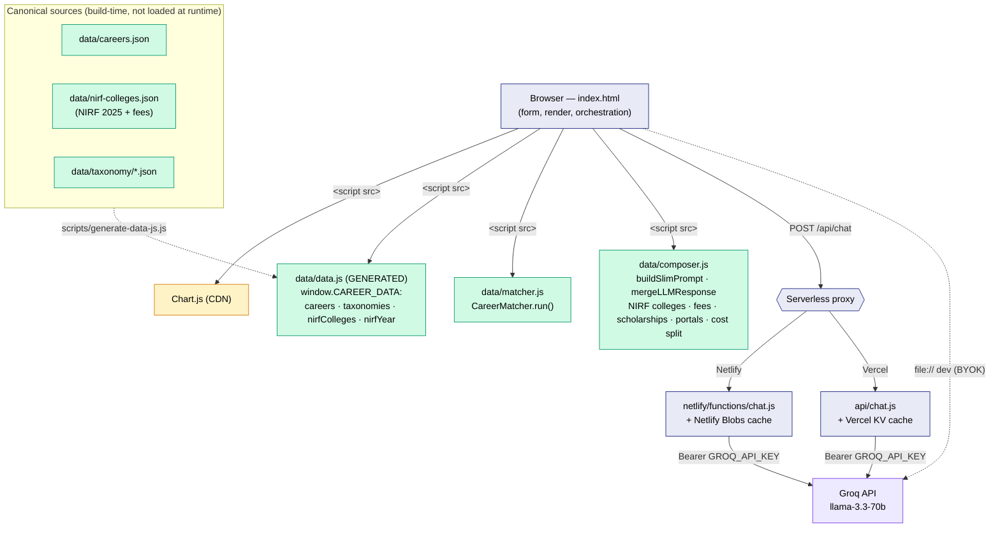
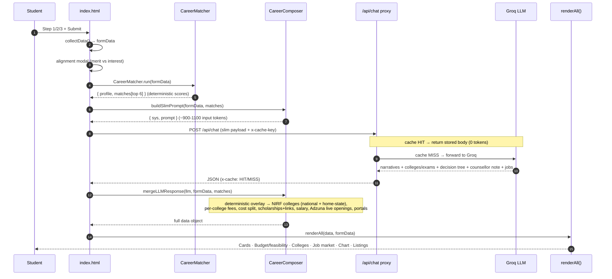
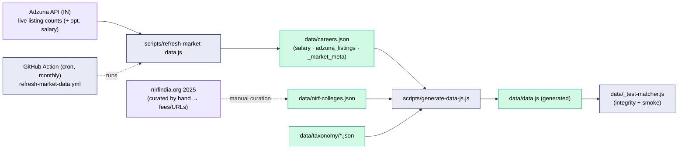
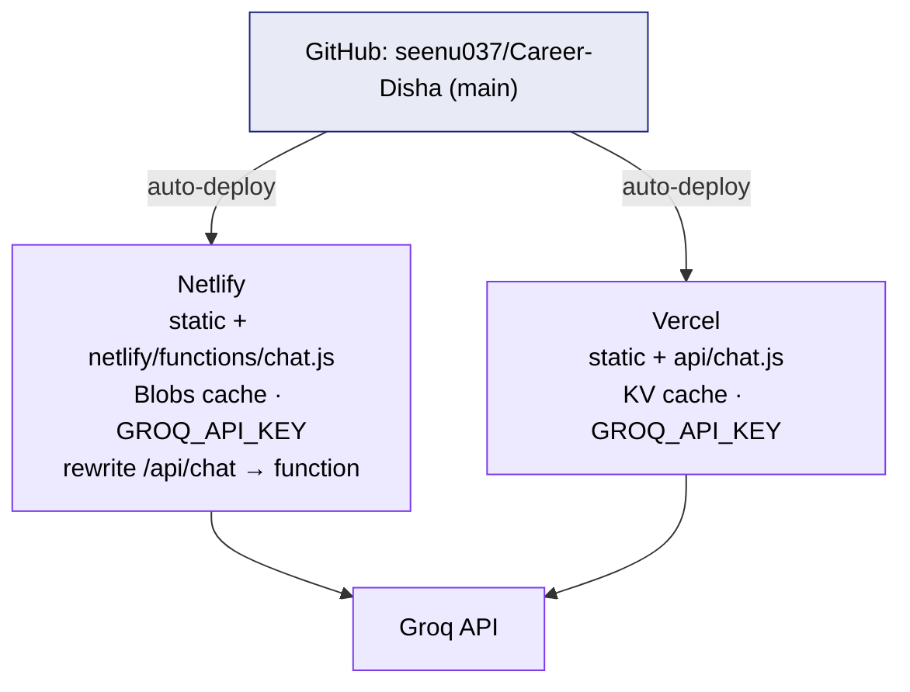

# CareerDisha — Architecture, Tech Stack & Flow

CareerDisha is a single-page career-guidance web app for Indian students. A 3-step form feeds a
**deterministic match engine** that ranks careers locally; an LLM then writes only the narrative
content. Real reference data (NIRF college rankings, Adzuna job listings, scholarship/fee sources)
is curated offline and shipped as static JS so the app stays fast and cheap. It deploys to **both
Netlify and Vercel** from the same repo.

---

## 1 · Tech stack

| Layer | Technology |
|---|---|
| **Frontend** | Vanilla HTML/CSS/JS in a single `index.html` (no framework, no build step) |
| **Charts** | Chart.js (CDN) |
| **Client data** | `data/data.js` (generated) → `window.CAREER_DATA`; `matcher.js`, `composer.js` as `<script src>` |
| **Serverless proxy** | Dual: `netlify/functions/chat.js` (Netlify) **and** `api/chat.js` (Vercel) — same Groq proxy contract |
| **LLM** | Groq API — `llama-3.3-70b-versatile` (OpenAI-compatible) |
| **Response cache** | Netlify Blobs (Netlify) / Vercel KV (Vercel), keyed by a canonical profile hash; best-effort |
| **Offline data** | Node scripts (`scripts/`) — Adzuna API for live job counts, NIRF 2025 for colleges |
| **Automation** | GitHub Actions (scheduled market-data refresh) |
| **Hosting** | Netlify and/or Vercel (static site + serverless function), auto-deploy from GitHub `main` |
| **Secrets** | `GROQ_API_KEY`, `ADZUNA_APP_ID/KEY`, KV/Blobs tokens — env vars only, never committed |

**Runtime principle:** anything formulaic (match scores, salaries, fees, colleges, portals, cost
split) is computed deterministically from static data; the LLM only writes prose (narratives,
counsellor note, decision tree, college/exam suggestions for non-NIRF fields).

---

## 2 · Component architecture

---

## 3 · Request flow (one form submission)

---

## 4 · Offline data pipeline (how the static data is produced)

- **`refresh-market-data.js`** — pulls Adzuna IN live-listing counts into `careers.json`
  (`job_density`/`growth` stay hand-authored; salary opt-in via `--with-salary`). Best-effort,
  rate-limited, `--dry-run` supported.
- **`nirf-colleges.json`** — NIRF 2025 rankings (full national lists, ~587 colleges) with curated
  official URLs + indicative total-program fee ranges on prominent institutes.
- **`generate-data-js.js`** — deterministically builds `data/data.js` from `careers.json` +
  `nirf-colleges.json` + `taxonomy/*.json`. `data.js` is generated; never hand-edited.

---

## 5 · Deployment

The browser always calls **`/api/chat`**. On Vercel that's `api/chat.js`; on Netlify a rewrite in
`netlify.toml` maps it to `netlify/functions/chat.js`. Local `file://` falls back to calling Groq
directly with a user-supplied key (BYOK). Deployment Protection must be **off** on Vercel for a
public site.

---

## 6 · Data provenance (real vs indicative — the honesty map)

| Field | Source | Status |
|---|---|---|
| Match score, decision logic | `matcher.js` over hand-authored career vectors | computed |
| **Colleges (top-5 national + home-state)** | **NIRF 2025** (official) | **real**, state-filtered |
| College official website | curated per institute | real (prominent only) |
| **Live job openings** | **Adzuna IN** search count | **real**, dated; "limited" when sparse |
| Salary (entry/mid) | hand-authored bands (Adzuna IN too sparse) | indicative, labelled |
| **Education cost split** (tuition/board/books) | per-**course** ranges, govt→private | indicative, state-adjusted |
| Tuition "verify" link | state FRA / ICAI / MCC fee pages | real fee-listing page where available |
| Scholarships + amounts | NSP / state portals (deep links) | indicative amounts, real links |
| `job_density`, `growth`, demand/competition | hand-authored heuristics | indicative ("est.") |
| Narratives, counsellor note, decision tree | Groq LLM | generated |

---

## 7 · File reference

| Path | Role |
|---|---|
| [index.html](index.html) | The app — markup, CSS, form/render JS, `callAPI` orchestration |
| [data/matcher.js](data/matcher.js) | Deterministic scoring engine → `window.CareerMatcher` |
| [data/composer.js](data/composer.js) | Slim prompt + merge; NIRF colleges, fees, cost split, scholarships, portals |
| [data/data.js](data/data.js) | **Generated** runtime data → `window.CAREER_DATA` |
| [data/careers.json](data/careers.json) | Canonical careers (+ Adzuna listings, salary, `_market_meta`) |
| [data/nirf-colleges.json](data/nirf-colleges.json) | NIRF 2025 colleges per category (+ fees/URLs) |
| [data/taxonomy/](data/taxonomy/) | interest/strength/subject label → canonical-ID maps |
| [data/_test-matcher.js](data/_test-matcher.js) | Headless smoke + data-integrity test (`node data/_test-matcher.js`) |
| [scripts/refresh-market-data.js](scripts/refresh-market-data.js) | Adzuna refresh → careers.json + regen data.js |
| [scripts/generate-data-js.js](scripts/generate-data-js.js) | careers.json + taxonomy + NIRF → data.js |
| [scripts/refresh-data.ps1](scripts/refresh-data.ps1) | Windows one-command refresh wrapper |
| [api/chat.js](api/chat.js) | Vercel Groq proxy + KV cache |
| [netlify/functions/chat.js](netlify/functions/chat.js) | Netlify Groq proxy + Blobs cache |
| [netlify.toml](netlify.toml) | Netlify config + `/api/chat` rewrite |
| [.github/workflows/refresh-market-data.yml](.github/workflows/refresh-market-data.yml) | Scheduled data refresh |

---

## 8 · Run / test

- **Local:** open `index.html` (BYOK Groq key) or `netlify dev` (uses the function + env key).
- **Refresh data:** `npm run refresh-data` (or `refresh-data:dry`); `npm run generate-data`.
- **Test:** `npm run test:data` → matcher across 8 demo profiles + integrity checks.
